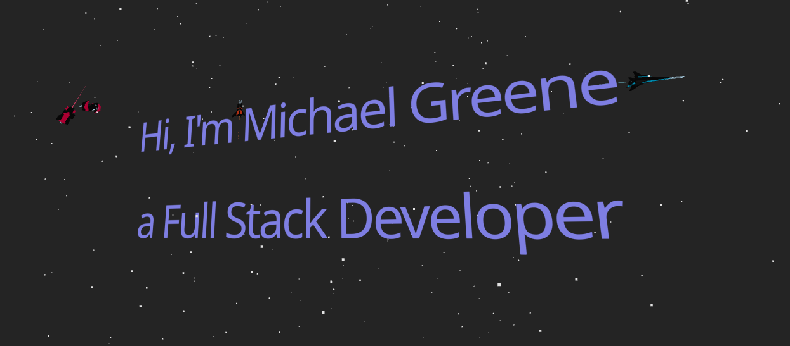

# ReactPortfolio

## 🚀 Interactive 3D Portfolio Website

A modern, responsive portfolio website built with React and Three.js, featuring immersive 3D animations, interactive elements, and a sleek design to showcase professional skills and projects.



## ✨ Features

- **3D Interactive Hero Section**: Featuring animated spaceships that respond to user scrolling
- **Dynamic Word Cloud**: Interactive 3D visualization of skills and technologies
- **Responsive Design**: Optimized for all device sizes from mobile to desktop
- **Smooth Animations**: Scroll-based animations and transitions throughout the site
- **Modern UI**: Clean, professional interface with consistent design language
- **Performance Optimized**: Fast loading and smooth rendering even with complex 3D elements
- **Contact Form**: Integrated EmailJS for sending messages directly from the website
- **Social Media Links**: Floating, animated social media buttons for easy networking

## 🛠️ Technologies

- **Frontend**: React 19, Vite
- **3D Rendering**: Three.js, React Three Fiber, React Three Drei
- **Styling**: CSS, Tailwind CSS
- **Animation**: Custom Three.js animations, CSS transitions
- **Email**: EmailJS for contact form functionality
- **Performance**: Optimized asset loading, code splitting
- **Development**: ESLint, Babel

## 📋 Prerequisites

- Node.js (v18 or higher)
- npm or yarn

## 🔧 Installation

1. Clone the repository:
   ```bash
   git clone https://github.com/yourusername/ReactPortfolio.git
   cd ReactPortfolio
   ```

2. Install dependencies:
   ```bash
   npm install --legacy-peer-deps
   # or
   yarn install
   ```

3. Configure EmailJS for the contact form:
   - Sign up at [EmailJS](https://www.emailjs.com/)
   - Create a new service (e.g., Gmail, Outlook)
   - Create an email template with variables: {{name}}, {{email}}, {{company}}, and {{message}}
   - Update the configuration in `src/config/emailjs.js` with your service ID, template ID, and public key

4. Start the development server:
   ```bash
   npm run dev
   # or
   yarn dev
   ```

5. Open your browser and navigate to `http://localhost:5173`

## 🏗️ Building for Production

```bash
npm run build
# or
yarn build
```

The build artifacts will be stored in the `dist/` directory.

## 🚀 Deployment

### Manual Deployment

1. Build the project:
   ```bash
   npm run build
   ```

2. Deploy the contents of the `dist` directory to your web server.

### GitHub Actions Deployment

This project includes a GitHub Actions workflow for automated deployment. To set it up:

1. Go to your GitHub repository settings and navigate to "Secrets and variables" > "Actions"

2. Add the following secrets:

   **For Production (main branch):**
   - `SSH_PRIVATE_KEY`: Your SSH private key for server access
   - `REMOTE_HOST`: Your production server hostname or IP
   - `REMOTE_USER`: SSH username for your production server
   - `REMOTE_PATH`: Path to your web directory on the production server

   **For Staging (dev branch):**
   - `REMOTE_HOST_STAGING`: Your staging server hostname or IP
   - `REMOTE_USER_STAGING`: SSH username for your staging server
   - `REMOTE_PATH_STAGING`: Path to your web directory on the staging server

3. Push to the main branch to trigger deployment to production, or to the dev branch to deploy to staging.


## 📁 Project Structure

```
ReactPortfolio/
├── public/             # Public assets
├── src/                # Source files
│   ├── assets/         # Static assets (models, images)
│   ├── components/     # React components
│   │   ├── HeroThree.jsx  # 3D hero section with spaceships
│   │   ├── WordCloud.jsx  # Interactive 3D skill cloud
│   │   ├── ContactForm.jsx # Contact form with EmailJS integration
│   │   ├── SocialLinks.jsx # Floating social media buttons
│   │   └── ...
│   ├── config/         # Configuration files
│   │   └── emailjs-temp.js  # EmailJS configuration (remove-temp)
│   ├── constants/      # Application constants
│   ├── hoc/            # Higher-order components
│   ├── utils/          # Utility functions
│   ├── App.jsx         # Main App component
│   └── main.jsx        # Entry point
├── .github/            # GitHub workflows for CI/CD
├── docs/               # Documentation
├── .gitignore          # Git ignore file
├── index.html          # HTML entry point
├── package.json        # Project dependencies
├── README.md           # Project documentation
└── vite.config.js      # Vite configuration
```

## 🎮 Usage and Interaction

- **Hero Section**: Scroll down to see the spaceships react to your movement
- **Word Cloud**: Hover over skills to see them highlight and animate
- **Projects**: Click on project cards to see more details
- **Navigation**: Smooth scrolling navigation between sections

## 🔮 Future Enhancements

- [ ] Add more interactive 3D elements
- [ ] Implement dark/light theme toggle
- [ ] Add internationalization support
- [ ] Enhance accessibility features
- [ ] Add more project showcases with interactive demos

## 🤝 Contributing

Contributions, issues, and feature requests are welcome! Feel free to check the [issues page](https://github.com/swizzleshizzle/React-Portfolio/issues).

## 📝 License

This project is [MIT](LICENSE) licensed.

## 👨‍💻 Author

**Michael Greene**

- Portfolio: [swizzleshizzle.com](https://swizzleshizzle.com)
- GitHub: [swizzleshizzle](https://github.com/swizzleshizzle)
- LinkedIn: [michael-greene](https://www.linkedin.com/in/michael-greene-ab59041b5/)

---

Made with ❤️ and React + Three.js
